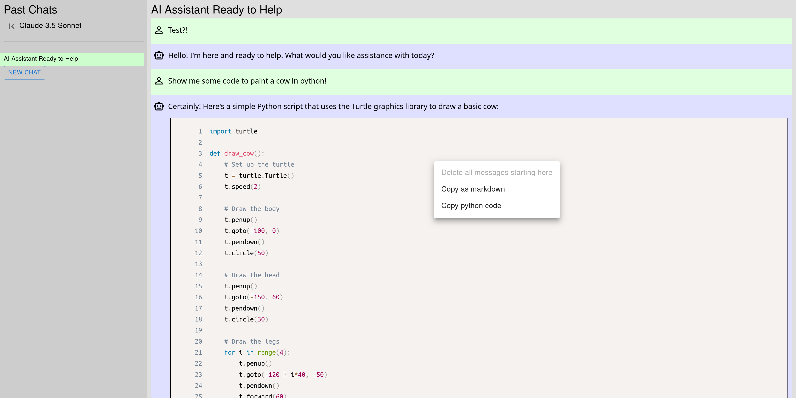

# Client for AWS bedrock

This repo is a client app for using AWS bedrock as a LLM provider to chat with.
Currently, it supports choosing a model (which has to be whitelisted by AWS first) and then
chatting with the model in multiple chats.

A chat headline is created automatically after the first interaction. A few relevant context
menu entries exist.

# Configuration

1. Create a dynamo db table
   2. Primary key is a composite of `table-key` (string) and `created` (number)
   3. Choose dynamic provisioning, otherwise it costs money even if not in use
   4. 100 Read Units and 50 Write Units max works flawlessly in my experience
   5. Cost for me is <2€ per month with quite heavy use
6. On AWS bedrock, pick your region and apply for model access for models of interest
   7. Claude 3/3.5 models are very good. Haiku is good, cheap and fast. Sonnet 3.5 is SOTA.
8. Create an IAM policy and group which has access to the models and to the dynamo db table
   (see template `iam_policy_template.yml` - not the cleanest form, but it will work)
9. Create an IAM user who is assigned to a group which is has the policy created before
10. Create an IAM access / secret key (or manage via SSO)
11. Copy the file `.env.local-template` to `.env.local`.
12. Replace the respective fields in `.env.local` with the credentials and resources created above

